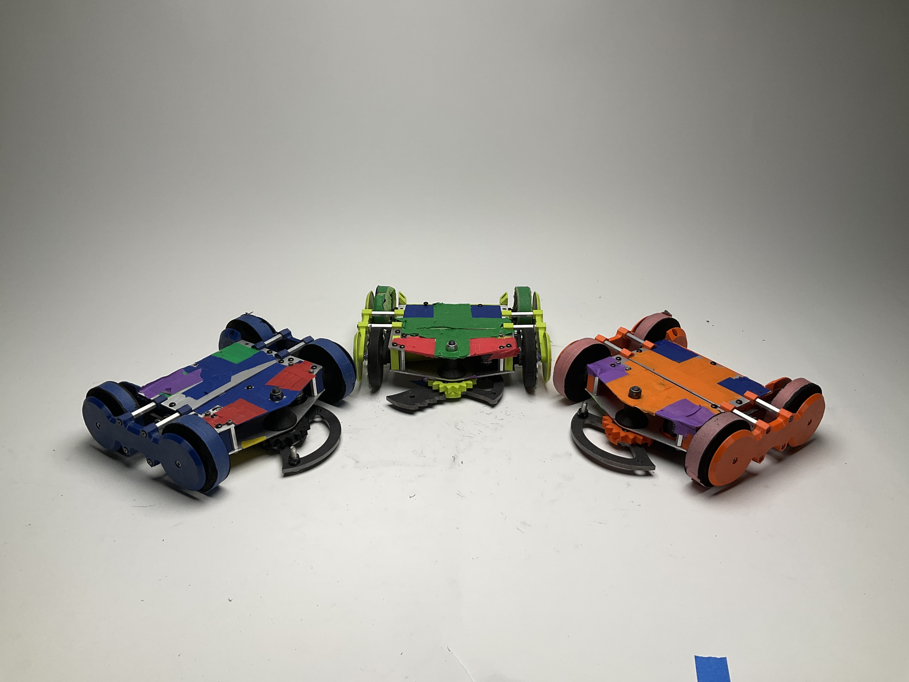

# Autonomous-24-25
This code was used to control Huey, our 3 pound fully autonomous battle bot, at NHRL's May 2025 competition. Huey was a modified version of the popular Jolt kit from Repeat Robotics, with titanium cleats added and colorful tape used to identify and orient Huey in our autonomous system. This system can be used for ANY battle bot in NHRL, so long as it follows the coloring scheme on Huey's lid of a solid colored robot with 2 front corners and 2 back corners of different color.




# main.py

The `main.py` file is the main code that calls every other function from the subsystems.

## Table of Contents
- [Features](#features)
- [Prerequisites](#prerequisites)
- [Usage](#usage)
- [Configuration](#configuration)

## Features
- Captures video from a camera or pre-recorded file
- Warps the captured image using homography transformation
- Detects objects using YOLO or Roboflow models
- Identifies robot corners and orientation
- Computes movement decisions based on detected positions
- Sends movement commands to motors via serial communication
- Displays visual debugging information

## Prerequisites
Ensure you have the following installed:
- Make sure to run `pip install -r requirements.txt` for ease
- Python 3.10+
- OpenCV
- NumPy
- Tkinter
- Pandas
- `line_profiler` (for profiling)
- `torch` (for machine learning models)
- `cv2`, `os`, `time`
- `onnxruntime`
- `openvino`
- Additional dependencies for `RoboflowModel` and `YoloModel`

## Usage
Run the main script using:
```bash
python main.py
```
or 
```bash
python3 main.py
```
For debugging and profiling:
```bash
kernprof -l -v --unit 1e-3 main.py
```

## Configuration
Modify the following global variables in `main.py` to change behavior:

- `COMP_SETTINGS`: Optimize for competition (disable visuals)
- `WARP_AND_COLOR_PICKING`: Enable redoing warp and color picking
- `IS_TRANSMITTING`: Set to True when using a live robot
- `SHOW_FRAME`: Toggle displaying frames
- `DISPLAY_ANGLES`: Show current and future orientation angles
- `IS_ORIGINAL_FPS`: Process every frame
- `camera_number`: Path to video file or camera input


# Development Folders

## 'corner_detection' Folder:

code for corner detection and calculating orientation of the robot

How to test corner detection:
1. Change the hardcoded image file paths in Lines 8 and 9 in `detect_our_robot.py`
2. In the command line, run `python corner_detection` or `python3 corner_detection`

## 'scripts' Folder: 

bash script for automation Note: Make sure to navigate to the 'Autonomous-24-25/scripts' directionary before use

Refer to the specific README in scripts Folder

Setting the homography matrix using `homography.py`
1. Ensure your `image_flashing` branch is up to date
2. Download some NHRL cage image from a video using the same angle; ensure you know the name of the file
3. At line 6 in `homography.py`, change the filepath stored at `test_img` to your image filepath
4. Begin selecting corners by running `python homography.py` or `python3 homography.py`; a pop-up window should appear
- Pressing "esc" will kill the window and the program
- Pressing "z" will undo the last point you selected 
5. Select the corners of the arena floor IN ORDER: TOP-LEFT, TOP-RIGHT, BOTTOM-RIGHT, BOTTOM-LEFT
6. The code should automatically write the resulting homography matrix to the matrix.txt file, which is called in warp.py

How to collect data using `process_battlefield_to_images`:
1. Ensure your `image_flashing` branch is up to date
2. Manually download an NHRL fight video using the same angle; ensure you know the name of the file
3. Upload the video to the `image_flattening` directory. Because the videos are normally 3 minutes in length, we speficy them to not be tracked by Git
4. cd into the `image_flattening` directory by running `cd image_flattening` in your terminal
5. Set the parameters of the function at the bottom of the `video_stream_crop.py` file:
- The first parameter, the filepath, should be whatever you named your .mp4 file
- The second parameter is the framerate, or how often to save a frame from the video. 1-2 frames per second should suffice
6. Extract images from the video by running `python video_stream_crop.py` or `python3 video_stream_crop.py` and wait an appropriate amount of time (generally ~3 minutes)
7. The images should be saved under `image_flattening\IMG_`; download locally and use as you see fit