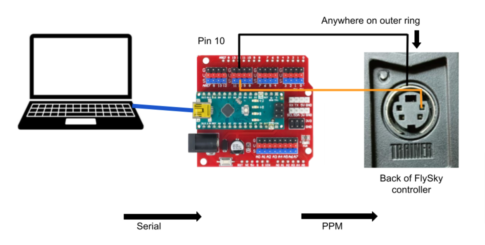
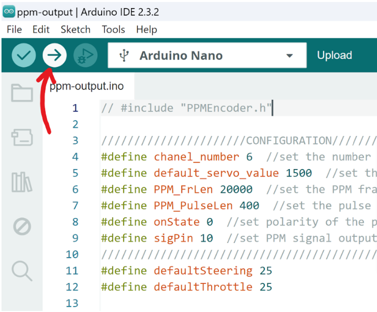

# Transmission 

## Description
This code controls a motor through python code. Follow these instructions for hardware and software set up.

## Required Packages
pyserial: `python -m pip install pyserial`

## Hardware Setup
1. Set FlySky controller in [trainer mode](https://clover.coex.tech/en/trainer_mode.html)
    * Use the controller with the “Kenny” sticker
    * If you get a warning that states: “Place all switches in their up position…”
        * Put all the top switches up and the left joystick in the center bottom 
    * The the top right switch is used “for taking the control” (put it in the down position)
2. To see channel values on FlySky controller:
    * Hold ok to get to settings
    * Select “Functions Setup” via the OK button
    * Hit down till you are on “Display”, then press OK

3. Connect wires, cables as shown in the circuit diagram

    

4. Download [Arduino IDE](https://www.arduino.cc/en/software) (if not previously installed)
5. Download `receive_serial_and_send_PPM.ino`
6. In the Arduino IDE, select the Arduino nano board and appropriate port
    
    

    * if you’re unsure of the port, unplug and replug the arduino and see which option disappears and reappears

7. Upload the .ino code to Arduino

    

